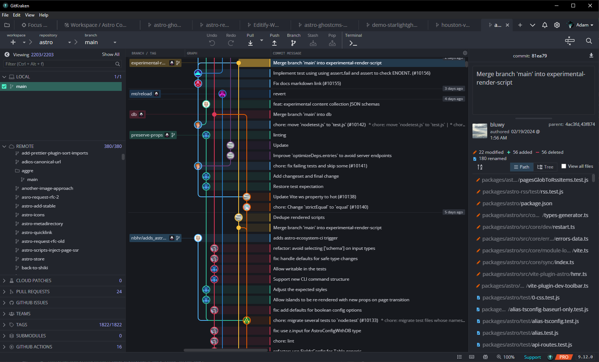
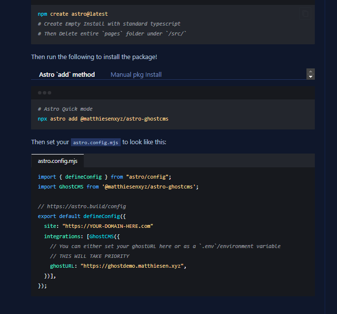

# Houston Theme Collection

## Editors

### [`Visual Studio Code`](./packages/houston-vscode/README.md)

Visual Studio Code theme featuring cool blues, minty greens, and soft purples and [Astro](https://github.com/withastro/astro)'s mascot Houston.

## GitClients

### [`GitKraken`](./packages/houston-gitkraken/README.md)

GitKraken theme generated completely from the Houston Color Pallet to bring all of the lovely colors into your Git Management!

## FrontEnd

### [`Astro / Expressive Code`](./packages/houston-astro/README.md)

The same cool blues, minty greens, and soft purples your used to on Visual Studio, but now packaged for ExpressiveCode's Astro package and Astro's Shiki!

Example of Houston on a starlight site

## Issues

Houston is a work in progress. Please [open an issue on our repository](https://github.com/withastro/houston-vscode/issues).
